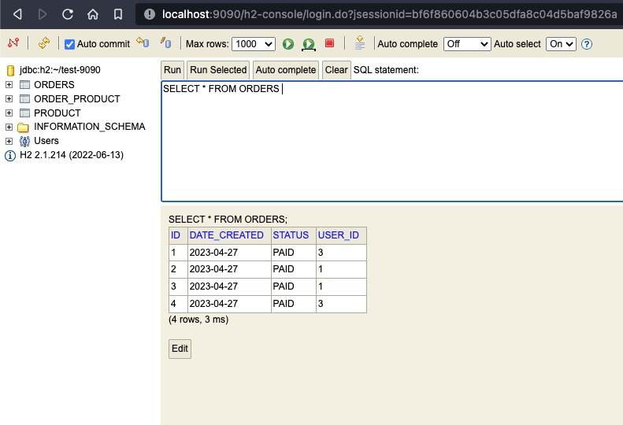
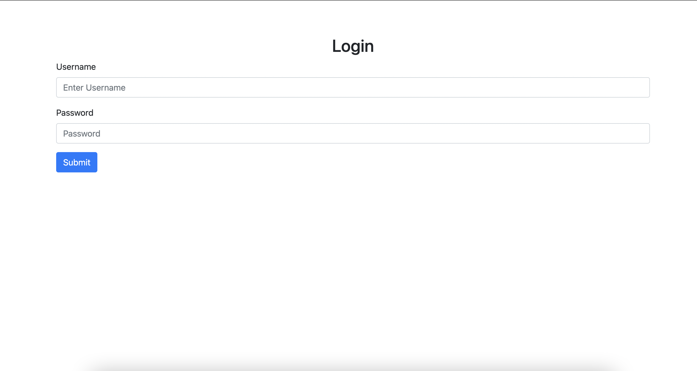
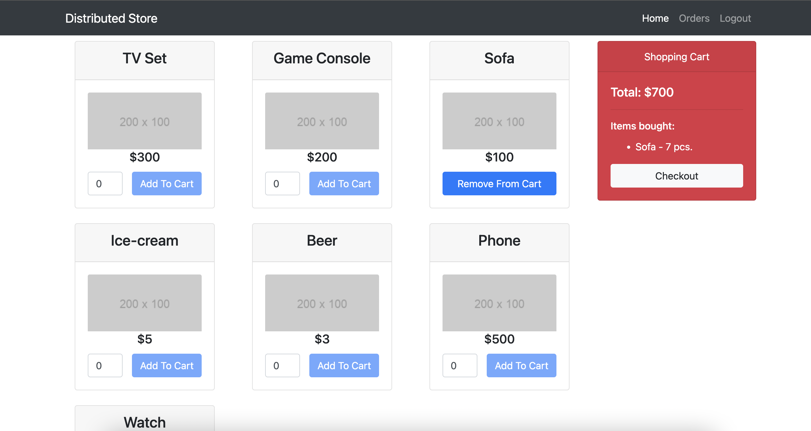
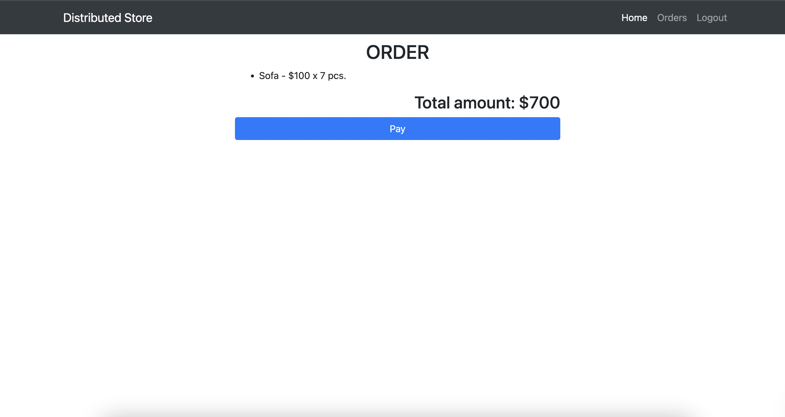
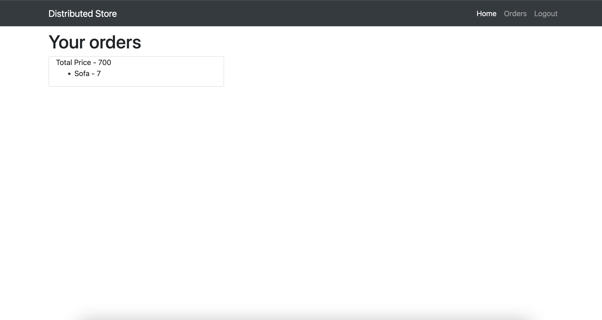

# Distributed E-Commerce Store Implemented using SpringBoot and Angular.

Welcome to our Distributed Store project, an ecommerce store that takes advantage of distributed systems to provide a
seamless shopping experience. Our platform is designed to place orders on multiple servers using the PAXOS consensus
algorithm, ensuring that all orders are processed correctly and efficiently.

To maintain fault tolerance, our system also utilizes the Gossip Algorithm, which allows nodes to communicate with each
other and share information about the state of the system. This ensures that even if one or more nodes fail, the rest of
the system can continue to operate smoothly.

Furthermore, our platform uses the 2 Phase Commit (2PC) protocol to populate products on each server, ensuring that all
servers have consistent and up-to-date product information. This guarantees that our customers receive accurate
information about product availability and pricing, no matter which server they are connected to.

## Clickable Video Link

## Requirements

1. Java 17 or higher
2. npm 16.13.1 or higher
3. http-server (installed using `npm install -g http-server` or `brew install http-server`)
4. Docker (only if trying to run docker image)

# Running Instructions

## How to start the application

The execution order of all this project shall be

1. Start the java coordinator.
2. Start required number of apps (server instances of backend ecommerce store).
3. Start the frontend.

### Steps to run from command line

1. Start the coordinator jar using -

   - `java -Dserver.port=<port_no> -Dserver.host=<hostname> -jar Coordinator.jar`

   For example, when you want to run it on `localhost:8080`

   - `java -Dserver.port=8080 -Dserver.host=localhost -jar Coordinator.jar`

2. Start the required app instance using -

   - `java -Dserver.port=<port_no> -Dserver.host=<hostname> -Dcoordinator.host=<hostname> -Dcoordinatorport=<port_no> -jar Server.jar`

   For example, when you want to run the server on `localhost:9090` and connect it to coordinator on `localhost-9090`
   run the following command -

   - `java -Dserver.port=9090 -Dserver.host=localhost -Dcoordinator.host=localhost -Dcoordinatorport=8080 -jar Server.jar`

Make sure to enter the VM args in exactly this order.

#### Steps to start up the frontend.

1. Unzip frontend.zip.
2. Navigate to inside the frontend folder.
3. Assuming http-server is installed. run `http-server -p 4200`
4. Navigate to `http://localhost:4200/` to start using the application.

## Docker Image of the Project

You can start the docker image of the project, which will start the angular frontend, Coordinator and 5 servers all
connected to each other.

Here are the instructions to get and run the docker image of our project:

1. Make sure you have `docker` installed and the `docker` Daemon running
2. Go to your terminal and type the following command:
   - `docker pull anizmo/arm-distributed-store`
3. Once the pull is complete, run it using the following command:
   - `docker run -p 4200:4200 -p 8080:8080 anizmo/arm-distributed-store`
4. The above command runs the docker image - `anizmo/arm-distributed-store` with the port 4200 and 8080 forwarded to
   your machine.
5. Wait for a minute for the spring boot applications to start

### Available Users

For the ease of testing we have created a lot of user profiles for each TA and group members. The available profiles are
as follows:

| Username  | Password   |
|-----------|------------|
| anuj      | potdar     |
| mitali    | ghotgalkar |
| rushikesh | mokashi    |

Similarly, we have created users for all the TAs. You can take a look at all the available users in
the `CoordinatorApplication` class.

### How to use the application

#### Once you start the frontend, making sure that the Coordinator and the Servers are up, you will be prompted to login. The respective database instances have been created as soon as server instances are started.

#### Login using any of the user credentials, each user has its own set of orders and the session is present across all

tabs.

#### After logging in, navigate to the home page to see a list of available products

#### Add the required amount of products to your card, click checkout.

#### After checking out, click pay (don't worry, you won't be charged) to create an order.

#### Click on `Orders` to check all your previous orders.

